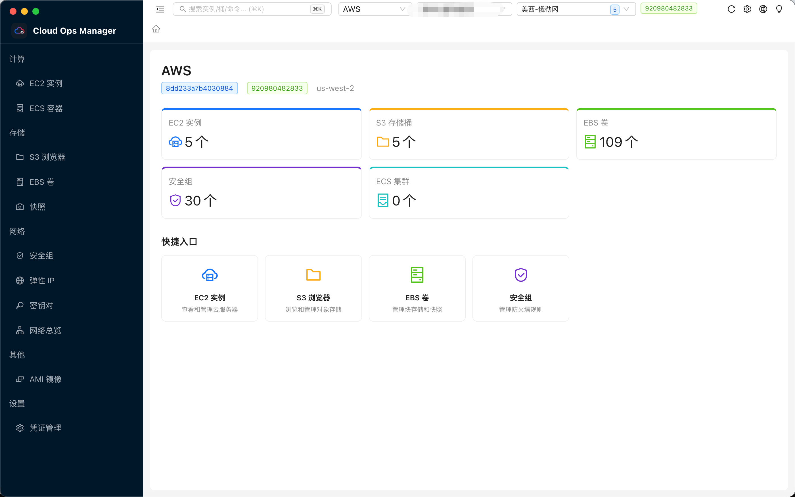
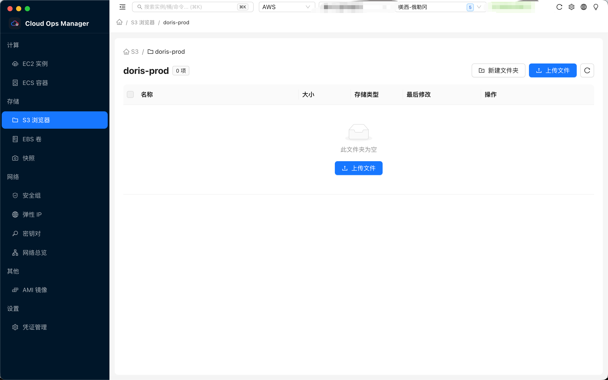
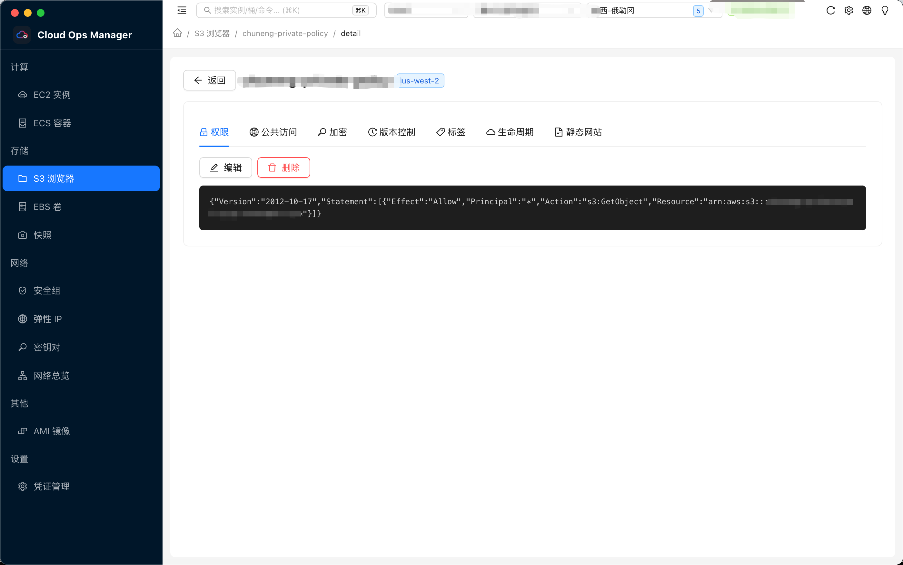
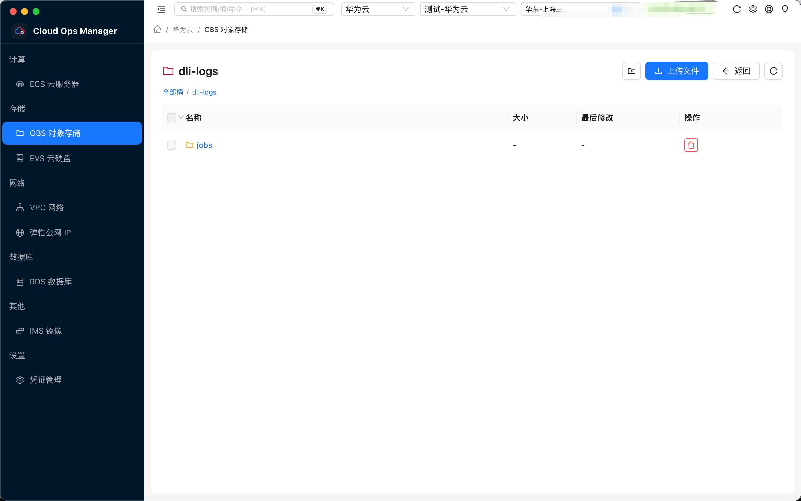
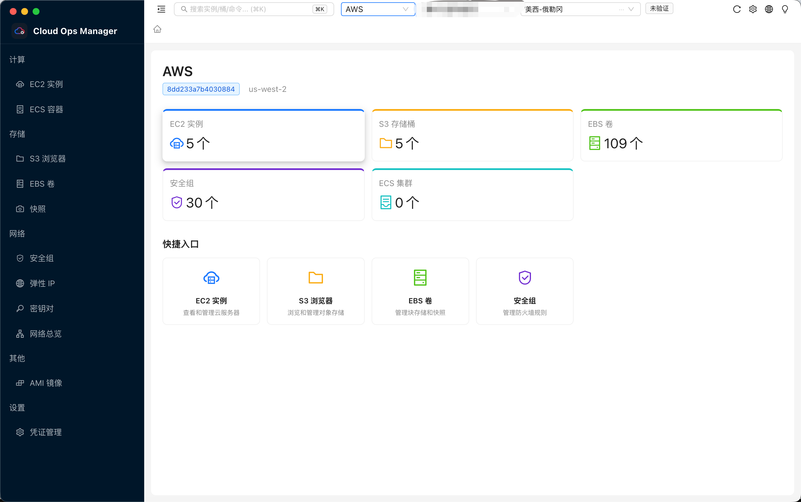
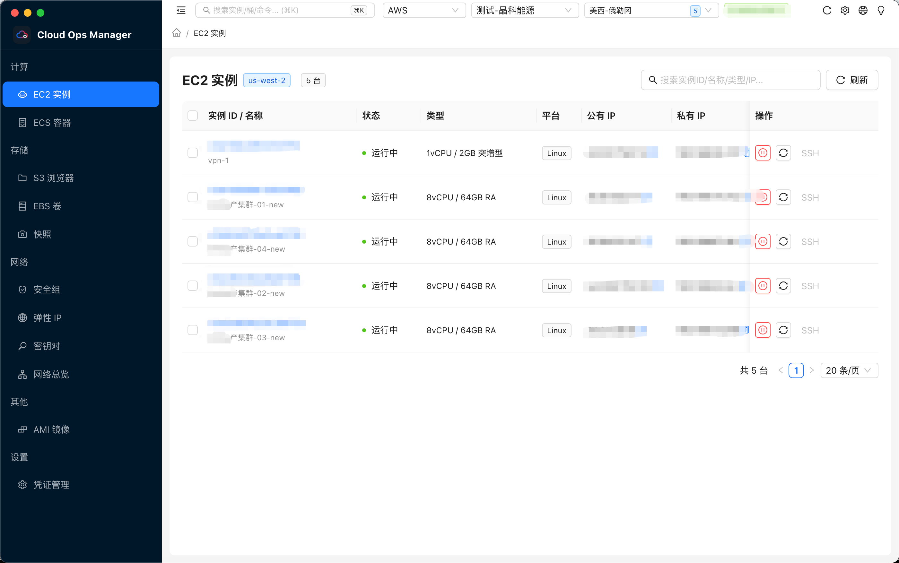
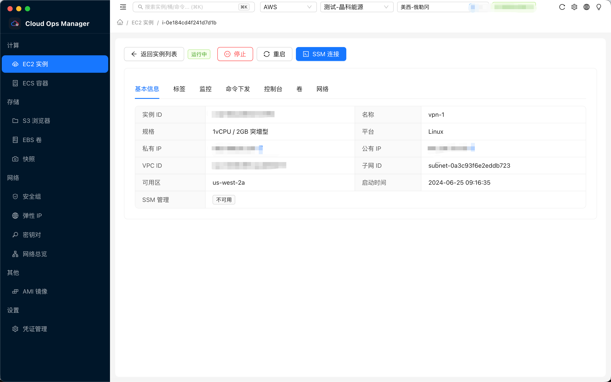
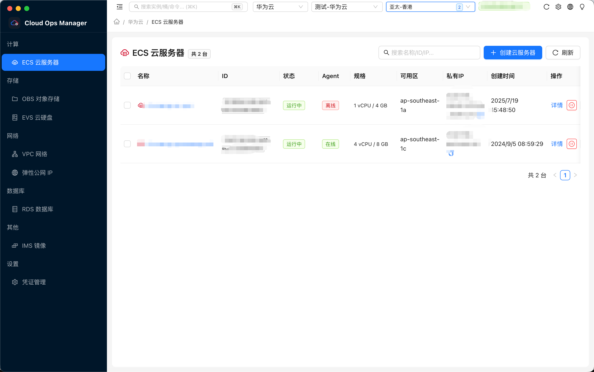
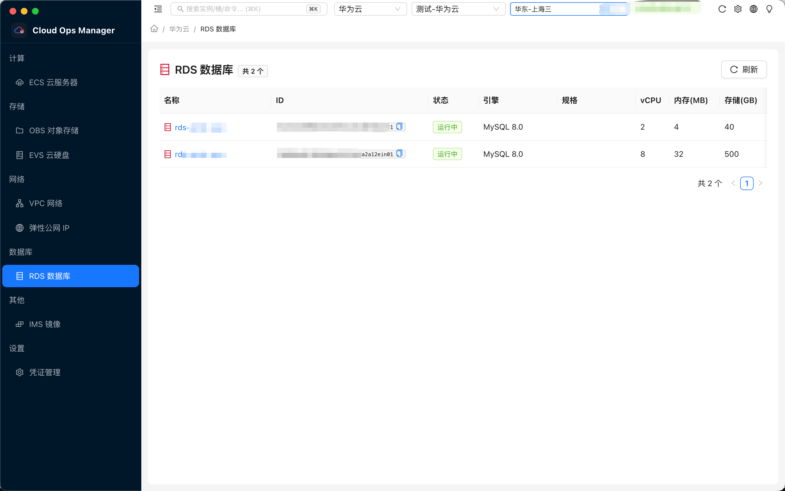

# Cloud Ops Manager

[English](./README.md)


---

## 免责声明

**Cloud Ops Manager** 仅供在对目标云资源拥有**合法授权**的前提下进行日常运维、资产查看与管理。本工具所提供的功能，旨在帮助运维与安全专业人员对自己负责的云账号、服务器、存储桶等资源进行检测与维护参考。

**未经授权，请勿利用本工具对任何云账号或计算机系统进行未授权访问或操作。** 利用本工具所提供的信息而造成的直接或间接后果和损失，均由使用者本人负责。

#### 再次声明：遵守《网络安全法》等相关法律法规，切勿用于非法渗透或未授权测试活动！

---

## 介绍

目前工具定位是**多云运维管理客户端**，主要涵盖两大模块：

| 模块 | 说明 |
|------|------|
| **云存储工具** | 针对 **S3 / OBS** 等对象存储：桶列表、对象浏览、上传、下载、预览、编辑、批量删除等 |
| **云服务工具** | 针对 **EC2 / ECS / RDS** 等计算与数据库服务：实例列表、启停、详情、远程命令、SSM 终端、VNC 等 |

顶栏支持 **AWS / 华为云** 切换；凭证在应用内 **AES-256-GCM** 加密保存，支持 **简体中文 / English** 双语界面。

---

## 软件架构

`Electron` + `React` + `Ant Design` + `TypeScript` + `Node.js` + `AWS SDK v3` + `华为云 SDK` + `OBS SDK` + `Zustand`

```
渲染进程 (React)
    ├─ AWS 页面 ──► electronAPI.{ec2,s3,...} ──► IPC ──► AWS SDK v3
    └─ 华为云页面 ► electronAPI.cloud.invoke ──► ProviderRegistry ──► 华为 SDK / OBS
```

---

## 功能实现图

> 将截图放入 `image/` 目录后，替换下方路径即可。



---

## 目前实现功能

**AWS：** EC2 列表/启停/重启/终止、详情多 Tab、CloudWatch 监控、SSM 终端与 Run Command、S3 桶与对象全生命周期、EBS 卷与快照、安全组、VPC 网络只读、弹性 IP、密钥对、AMI、ECS 集群/服务/任务下钻

**华为云：** ECS 列表/创建/详情、VNC、COC 命令下发、卷挂载、EIP 绑定、OBS 桶与对象浏览/上传下载/预览编辑、RDS 实例/备份/参数/用户、弹性公网 IP 独立管理页、EVS / VPC / IMS 列表、COC 预设与历史命令

**通用：** 凭证管理（按云厂商分组）、全局命令面板 `⌘K`、深/浅色主题、列表 API 缓存与手动刷新

---

## 云存储工具模块







---

## 云服务器工具模块











---

## 安装

### 下载安装（推荐）

从 **[Releases](https://github.com/S0x007/aws-ops-manager/releases)** 获取最新版本：

| 平台 | 格式 |
|------|------|
| macOS（Apple Silicon / Intel） | `.dmg` / `.zip` |
| Windows | NSIS 安装包 `.exe` |
| Linux | AppImage |

### 从源码运行

```bash
git clone https://github.com/S0x007/aws-ops-manager.git
cd aws-ops-manager
npm install
npm run dev
```

**环境要求：** Node.js 18+、npm 9+。在 **设置 → 凭证管理** 中添加 AWS 或华为云 AK/SK。

| 命令 | 说明 |
|------|------|
| `npm run dev` | 开发模式 |
| `npm run build` | 生产构建 → `out/` |
| `npm run package:mac` | 打包 macOS |
| `npm run package:win` | 打包 Windows |
| `npm run package:linux` | 打包 Linux |

---

## 常见问题

**1、macOS 提示应用程序「Cloud Ops Manager.app」无法打开**

未签名应用可能被 Gatekeeper 拦截，安装后执行（将应用拖入终端替换路径）：

```bash
sudo xattr -rd com.apple.quarantine "/Applications/Cloud Ops Manager.app"
```

**2、macOS 无法正常关闭窗口**

- 点击窗口左上角红色关闭按钮  
- 或使用 `Command + Q` 退出应用  

**3、OBS 目录大小/时间带 `~`**

表示该目录下对象超过 1 万个时的**部分统计**（大小为子对象累加，时间为最近修改时间）。

**4、列表数据不是最新**

点击页面 **刷新** 按钮，或切换 Region 后重新加载（AWS 列表默认约 5 分钟缓存）。

---

## 开发文档

- **[DEVELOPMENT.md](./DEVELOPMENT.md)** — IPC、Provider 扩展、排错  
- **[ROADMAP.md](./ROADMAP.md)** — 功能路线图  

---

## 许可证

[MIT](./LICENSE)
